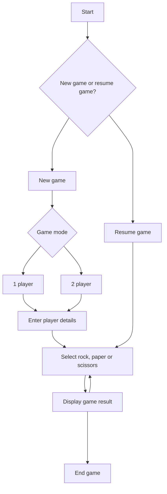

# Rock ˣ Paper ˣ Scissors

This is a basic web-based game in which users can play the classic game of Rock, Paper, Scissors versus a computer opponent or another player.

https://github.com/AdePhil/rps/assets/20032671/41c148ff-4e50-42e2-8951-15edfde473de


## Requirements

- Allow two players to enter their names.
- One of the players can also be the computer, i.e. player vs computer.
- Allow each to play a turn, one at a time, during which the player selects one of the option
  from rock, paper, scissors.
- During each turn notify who has won and increment the scores.
- In addition to implementing basic game play, the user must be able to save their game.
- The goal is for players to play in the same browser.

## Design Decisions

- In a 1-player mode, the computer functions as Player 2. This allows for the reuse of logic for both 1-player and 2-player game modes.
- Local storage is used to store previous game state, including details about the two players and the game mode.
- Created a custom hook called useRockPaperScissors to manage and colocate game logic, this also keeps most of the components lean.
- The utility functions in the game modules are pure functions that support logic in the useRockPaperScissors hook, since the don't modify react state or sync data with useEffect.
- The Layout file contains HTML code used by every page and is managed by React Router, rather than wrapping each page individually.
- Used conditional rendering to display components based on game states.

## Process Flow



## Future Improvements

- Advanced AI: Improve the computer's logic by learn the patterns of play from the human player.
- Unit Tests: Add unit tests to ensure the reliability and correctness of the game logic.
- Game History: keep history of more than one previous state (Display stats of the previous games).
- Enhanced UI/UX: Add animations and improve the overall look and feel of the game.
- Round Limit: Set an odd number of rounds to play
- Key board shortcut to perform actions like restart.
- Multiplayer Support: Extend the game to allow players to join from different browsers and play in real-time.

## Technologies Used

- React - frontend framework of choice.
- React Router - client side navigation.
- Tailwind - styling.
- React confetti - displays confetti when a player wins.
- uuid - generate unique ids.

## Setup

Clone Repository:

```bash
git clone https://github.com/AdePhil/rps.git
```

Navigate to the project directory:

```bash
cd rps-test
```

Install dependencies:

```bash
npm install
```

## Run App

```bash
 npm run dev
```
